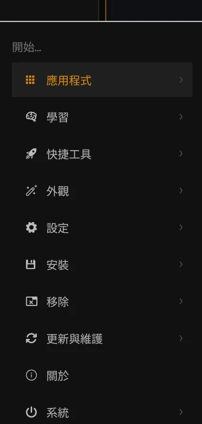
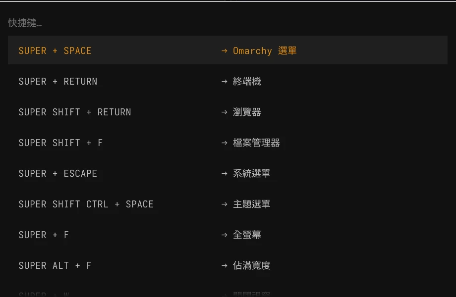
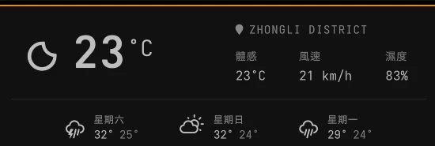
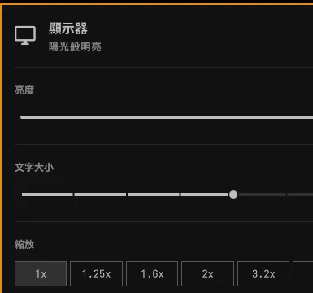

# Omarchy 简体中文界面

**简体中文** | [English](README.en.md)

面向 Omarchy 4 的非官方简体中文本地化项目。它从本机当前安装的 Omarchy 源文件生成用户级插件克隆，不修改 `/usr/share/omarchy`，也不在仓库中重新分发 Omarchy 的插件源码。

## 效果预览

以下截图来自实际安装本项目的 Omarchy 4 桌面。具体壁纸、主题和天气数据会因用户环境而异。

### 中文主菜单



### 中文快捷键面板



### 天气与日期

| 摄氏度、`km/h` 与中文天气字段 | 中文日期、月份和星期 |
| --- | --- |
|  |  |

### 常用系统面板

| 显示器与缩放 | 音频输入输出 |
| --- | --- |
|  |  |

| 网络与 DNS | 蓝牙设备 |
| --- | --- |
|  |  |

### 电源与性能模式


### AI 助手用量状态栏

在官方 Agents 状态栏的基础上，本项目增加了 Grok Build 与 Kimi Code，并修复新版 Codex CLI 与旧版收集器之间的审批策略兼容问题。组件会按当前 Omarchy 主题自动切换浅色/深色图标；未登录或没有有效数据的服务会自动隐藏。

| 服务 | 用量来源 | 启用方式 |
| --- | --- | --- |
| Codex | Codex app-server 与本地会话 | 登录 Codex CLI；兼容脚本不会读取或复制令牌 |
| Grok | Grok Build 账户限额与余额接口 | 运行 `grok login` |
| Kimi | Kimi Coding Plan 周额度与 5 小时窗口 | 设置 `KIMI_API_KEY`，或使用权限为 `0600` 的配置文件 |

Kimi 配置文件位于 `~/.config/omarchy/agents/kimi.json`：

```json
{
  "apiKey": "你的 API Key",
  "region": "cn"
}
```

`region` 可设为 `cn`（`api.kimi.com`）或 `global`（`api.kimi.ai`）。如果未来 Kimi Code CLI 在 `~/.kimi-code/` 写入登录信息，收集器也会自动识别。凭据仅用于服务端用量查询，不会写入状态栏读取的用量 JSON。

## 已汉化内容

- Omarchy 主菜单及 300 多个菜单项目
- 状态栏、插件设置和常用面板
- AI 助手状态栏新增 Grok、Kimi，用量限额展示和随主题切换的浅色/深色图标
- 修复新版 Codex CLI 不再接受旧 `untrusted` 审批策略时导致的 `initialize` 错误
- 音频、蓝牙、网络、显示器、电源和天气
- 日期、月份、星期及日历
- 天气使用摄氏度，风速使用 `km/h`，地名保持数据源原文
- 提醒、通知历史和 Omarchy 动态通知
- 系统托盘、剪贴板、表情、图片选择器、测速和 Wi-Fi 二维码
- 检测到 Fcitx 5/Rime 表情注释文件时，为表情选择器补充中文搜索关键词
- 锁屏、权限认证，以及 Omarchy 更新过程中的快照、软件包、迁移、错误与重启提示
- `Super + K` 快捷键面板及功能说明
- Omarchy 更新后的自动重新同步

专有名称、命令、真实文件路径和第三方应用内容不会强制翻译，例如 Omarchy、Hyprland、Codex、DNS、Docker 和 `Downloads`。

## 兼容性

- Omarchy `4.x`
- Node.js、jq、gum（Omarchy 4 默认环境已提供）
- 需要正在运行的 Omarchy Shell

本项目跟随系统已安装的插件结构生成汉化克隆。Omarchy 更新改变界面源码时，同步器会重新生成插件；如果上游结构发生不兼容变化，同步会明确失败并保留上一份可用版本。

## 安装

### 使用 AI 助手安装

如果你的 AI 助手能够在本机读取文件并执行终端命令，可以把下面的提示词完整发送给它：

```text
请帮我在当前这台 Omarchy 4 系统上安装这个简体中文本地化项目：
https://github.com/QueedWen/omarchy-zh-cn

要求：
1. 先阅读仓库的 README.md 和 install.sh，并检查当前系统、Omarchy 版本及依赖是否兼容。
2. 将仓库克隆到合适的用户目录；如果目标目录已经存在，不要覆盖，先检查现状。
3. 先运行 ./install.sh --dry-run。只有 dry-run 成功后，才运行 ./install.sh。
4. 不要修改 /usr/share/omarchy，也不要覆盖现有用户插件或个人配置。
5. 如果发现同名插件克隆或其他冲突，立即停止并告诉我具体情况；未经我明确确认，不要使用 --adopt-existing。
6. 任何需要密码、提权或覆盖文件的操作，都要先征得我的明确确认。
7. 安装完成后运行项目测试，检查同步结果和 Hyprland 配置错误，并告诉我修改了哪些位置、测试结果以及如何卸载。
```

### 手动安装

```bash
git clone https://github.com/QueedWen/omarchy-zh-cn.git
cd omarchy-zh-cn
./install.sh --dry-run
./install.sh
```

安装器会：

1. 检查 Omarchy 版本和依赖。
2. 使用官方 `omarchy plugin clone` 创建 22 个用户插件克隆。
3. 安装本地化同步器并生成中文插件。
4. 为 Agents 插件安装 Codex/Grok/Kimi 用量收集扩展及主题图标。
5. 将天气单位设为公制。
6. 将 `Super + K` 指向中文快捷键面板。
7. 从本机当前版本生成中文更新脚本，并将 Omarchy 菜单和状态栏的系统更新入口接入中文更新流程。
8. 安装 `post-update` 钩子，以便系统更新后自动同步。

如果你已经有相同用户名和插件后缀的克隆，安装器会停止，避免覆盖个人修改。只有确认这些克隆就是此前的汉化版本时，才使用：

```bash
./install.sh --adopt-existing
```

## 手动同步

```bash
omarchy-zh-sync
```

可用参数：

```text
--quiet           仅在失败时输出
--no-restart      同步后不重启 Omarchy Shell
--adopt-existing  接管来源匹配的现有插件克隆
```

## 系统语言与输入法

安装器不会自动修改系统区域设置或安装软件包。需要中文系统区域、字体或 Fcitx 5/Rime 输入法时，请参阅 [系统中文环境与输入法](docs/system-setup.md)。

## 卸载

```bash
./uninstall.sh
```

卸载器会恢复安装前的菜单和更新命令，移除受本项目管理的插件克隆，并恢复 `Super + K` 配置。Omarchy 的插件删除命令和卸载器都会保留带时间戳的备份，不会直接销毁用户配置。

## 修改范围

项目只写入以下用户目录：

```text
~/.config/omarchy/plugins/
~/.config/omarchy/extensions/omarchy-menu.jsonc
~/.config/omarchy/hooks/post-update.d/
~/.config/omarchy/shell.json
~/.config/hypr/bindings.lua
~/.local/bin/
~/.local/share/omarchy-zh-cn/
~/.local/state/omarchy-zh-cn/
```

`/usr/share/omarchy` 始终只读。安装器不会收集或上传通知历史、网络信息、位置、令牌或其他用户数据。

## 开发与检查

```bash
./tests/smoke.sh
```

在 Omarchy 机器上，测试还会使用临时 `HOME` 从系统当前插件生成一套隔离副本；不会触碰真实用户配置。

贡献翻译前请阅读 [CONTRIBUTING.md](CONTRIBUTING.md)。

## 声明

这是社区项目，与 Omarchy 官方无隶属关系。Omarchy 及其源码遵循其上游许可证；本仓库只包含本项目编写的安装逻辑、同步逻辑和中文翻译，采用 MIT 许可证。
